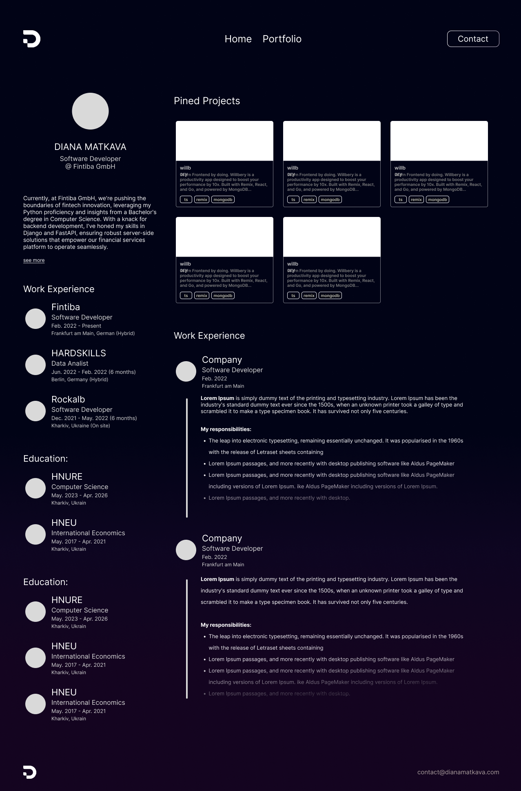
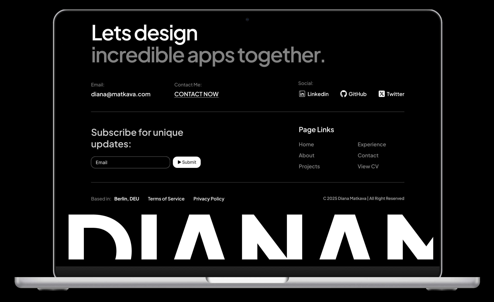

## My Personal Webpage

Welcome to my personal website, built with Next.js. This webpage serves as a comprehensive showcase of my professional journey, highlighting my best projects, work experience, and education.




### Contact

If you have any questions, collaboration proposals, or feedback, feel free to get in touch with me:

- Email: [diana.matkava.pr@gmail.com](mailto:diana.matkava.pr@gmail.com)
- LinkedIn: [LinkedIn Profile](https://www.linkedin.com/in/diana-matkava-7b7302227/)

### Technologies

This project is built using:

- Frontend: `Next.js`, `React`, `TypeScript`
- Styling: `Tailwind CSS`
- Deployment: `Vercel`

### Branches

- Master Branch: This branch contains the latest version of my portfolio, with up-to-date info.
- Archived Portfolio from 2022: Holds an older version of my portfolio.

### Getting Started

To run the project locally, follow these steps:

```shell
npm install
npm run dev
```
